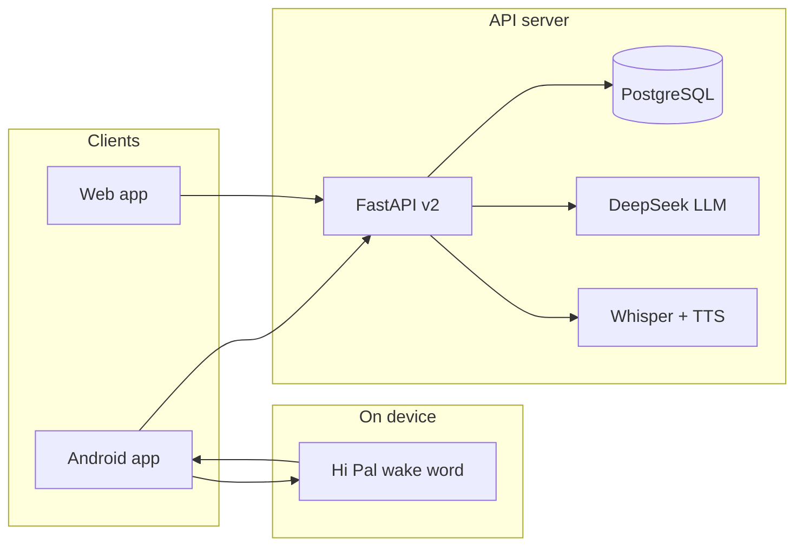

# AiPal

**AiPal** is a voice-first companion: users talk naturally; AiPal understands, proposes concise plans for **Today**, asks once to confirm, and nudges before commitments.

**Current version:** `2.6.11+61` (see [`apps/mobile/pubspec.yaml`](apps/mobile/pubspec.yaml))  
**Product status:** [`docs/PRODUCT.md`](docs/PRODUCT.md)

---

## Technology stack

| Layer | Technology |
|-------|------------|
| **Mobile / Web** | [Flutter](https://flutter.dev) (Dart), Provider, package `io.aipal.mvp` |
| **API** | [FastAPI](https://fastapi.tiangolo.com) (Python 3.12), REST + WebSocket Live voice |
| **Database** | PostgreSQL, SQLAlchemy async |
| **AI / voice** | DeepSeek LLM; self-hosted streaming Whisper STT (dev/staging default); edge-tts (TTS). Production public scale: evaluate managed STT per [ADR](docs/decisions/live-voice-v2.md) |
| **Memory** | mem0 (optional long-term user memory) |
| **Wake word** | OpenWakeWord on-device (“Hi Pal”); Android background foreground service (C2) |
| **Infra** | Tencent VM, Caddy HTTPS, Ansible deploy; GitHub Actions CI |
| **Distribution** | Google Play Internal, sideload APK, web `/app/` |

**Not used in v2:** React Native, Capacitor, or a separate native-only client.

### Architecture



---

## Repository layout

```
apps/api/           FastAPI v2 (/api/v2)
apps/mobile/        Flutter client (Android, web, iOS-capable)
packages/contracts/ OpenAPI types
infra/              Ansible + Caddy deploy
scripts/            Build, deploy, smoke tests, wake model training
docs/               PRODUCT.md, DELIVERABLES.md, decisions, stakeholder roadmap
legacy/             v1 historical references
.cursor/skills/     Cursor agent skills for release, mobile, brain
```

---

## Quick start (local dev)

```bash
# API + PostgreSQL
cd /home/dev/aipal
docker compose up -d postgres
cd apps/api && python3 -m venv .venv && source .venv/bin/activate
pip install -r requirements.txt
cp .env.example .env   # edit DEEPSEEK_API_KEY etc. — never commit .env
uvicorn app.main:app --reload --port 8102

# Mobile (Flutter SDK required)
cd apps/mobile && flutter pub get && flutter run \
  --dart-define=API_BASE_URL=http://127.0.0.1:8102/api/v2
```

---

## For testers (private repo collaborators)

- Install from **Play Internal** (invite link) or see [`docs/releases/PLAY_INTERNAL_v2.md`](docs/releases/PLAY_INTERNAL_v2.md).
- Report bugs via **GitHub Issues** (device, OS, build number from Settings).
- Roadmap narrative: [`docs/stakeholder/ROADMAP.md`](docs/stakeholder/ROADMAP.md).

---

## Security

Never commit:

- `apps/api/.env` — copy from [`apps/api/.env.example`](apps/api/.env.example)
- `.secrets/` — Android signing, Play API JSON (deploy VM only)

Release AAB/APK artifacts live under `.release_artifacts/` (gitignored).

---

## Docs

- [Deliverables tracker](docs/DELIVERABLES.md) — master done / not-done / improvements audit
- [Product status](docs/PRODUCT.md)
- [Wake word decision](docs/decisions/wake-word-engine.md)
- [Stakeholder roadmap](docs/stakeholder/ROADMAP.md)
- [Infra / deploy](infra/README.md)
- [Contributing](CONTRIBUTING.md)

## Roadmap board

Phase backlog (A → C4) is synced to **GitHub → Projects → [AiPal Roadmap](https://github.com/tfasanya79/aipal/projects)** from [`docs/PRODUCT.md`](docs/PRODUCT.md) on every push to `main`. See [CONTRIBUTING.md](CONTRIBUTING.md).
